# [atet](https://github.com/atet) / [**_matlab_**](https://github.com/atet/matlab/blob/master/README.md#atet--matlab)

[](#nolink)

# Introduction to MATLAB

**Estimated time to completion: 15 minutes**</br>No prior programming experience necessary!

* This introduction to programming only covers what's absolutely necessary to get you up and running
* We will be using **MATLAB Programming Language** to learn the critical building blocks of computer science

--------------------------------------------------------------------------------------------------

<a name="table-of-contents"></a>

## Table of Contents

### Introduction

* [0. Requirements](#0-requirements)
* [1. Preface](#1-preface)
* [2. Environment](#2-environment)
* [3. Variables](#3-variables)
* [4. Operators](#4-operators)
* [5. Data Structures](#5-data-structures)
* [6. Control Structures](#6-control-structures)
* [7. Epilogue](#7-epilogue)
* [8. Next Steps](#8-next-steps)

### Supplemental

* [Other Languages](#other-languages)
* [Acknowledgments](#acknowledgments)

--------------------------------------------------------------------------------------------------

<a name="0-requirements"></a>

## 0. Requirements

* **No prior programming experience necessary for this tutorial**
* **You don't need to download or install anything**; we will use this web-based programming environment for **Octave**, a free alternative to the commercial MATLAB language<sup>[[1]](#acknowledgments)</sup>: <a href="https://octave-online.net" target="_blank">https://octave-online.net</a>

[Back to Top](#table-of-contents)

--------------------------------------------------------------------------------------------------

<a name="1-preface"></a>

## 1. Preface

* Q: Which language should I start my journey with?
   * A: Start with the language that offers you immediate progress without being bogged down with installing and configuring stuff
* Q: Is the **MATLAB language** used here the same as.. Python, JavaScript, etc.?
   * A: Programming languages are more similar than they are different; all share the same foundation of **_computer science theory_**

[Back to Top](#table-of-contents)

--------------------------------------------------------------------------------------------------

<a name="2-environment"></a>

## 2. Environment

**Let's get comfortable with your working environment for this tutorial**

* Open a new browser window with the programming environment<sup>[[1]](#acknowledgments)</sup>: <a href="https://octave-online.net" target="_blank">https://octave-online.net</a>
* Adjust the tutorial and programming windows to be side-by-side:

[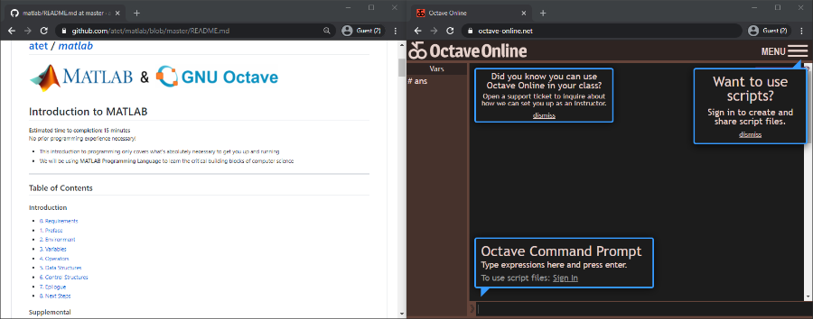](#nolink)

* In this programming environment:
   * The wide right side is the "**Command Prompt**" where we will program
   * The thin left right side is the "**Vars**" that shows all the information in memory
* All commands will be input at the bottom of the Command Promptand the results will be printed above
* Now let's **watch the following animation** to see this all in action:
   * Note: Every section has animated figures to help you with abstract concepts and guide you with coding

[](#nolink)

[Back to Top](#table-of-contents)

--------------------------------------------------------------------------------------------------

<a name="3-variables"></a>

## 3. Variables

### **Theory of Variables**

* Recall **variables** from algebra:
   * A symbol that represents a number (e.g. `h = 5`)
   * Mathematical operations can be performed on variables (e.g. `a = h × w`)

> _We know that the variable `a` should be 50, but we would've had to calculate that from `a = h × w`_
>
> [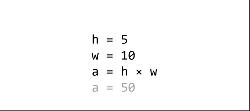](#nolink)

* Unlike the algebra homework in the previous example, there are helpful differences in computer programming:
   * The computer will handle remembering what values each variable is assigned and performing any calculations
   * It is common practice to give variables descriptive names to distinguish them and help _you_ remember what they represent

> _Once you tell the computer that `area = height × width`, the variable `area` is assigned the automatically computed value of 50_
>
> [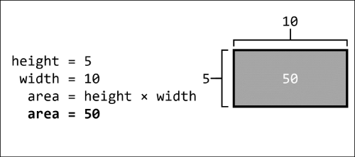](#nolink)

* If you were to re-write the above computation line-by-line in the **Command Prompt**, you will see that Octave will automatically compute `height` multiplied by `width` for you when you print `area`:
   * Note: The multiplication symbol in programming is the asterisk "`*`" (SHIFT+8)

[](#nolink)

### **Simple Variable Types**

* The Octave language allows you to store different types of data such as **numbers** and **strings** (a.k.a. string of characters)
* Run the following code in the R **script** area to see the variable `var` store a number and then be overwritten with a string:
   * Note: Strings must be enclosed in single quotation marks

```matlab
var = 5 * 10
disp(var)
var = 'Hello World!'
disp(var)
```

[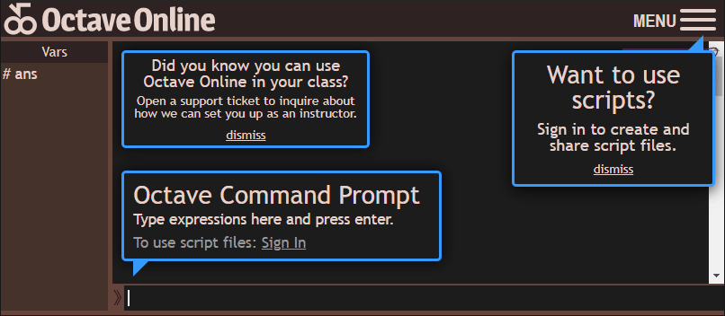](#nolink)

[Back to Top](#table-of-contents)

--------------------------------------------------------------------------------------------------

<a name="4-operators"></a>

## 4. Operators

### **Basic Operators**

* We touched a bit on operators in the previous section by using the assignment and multiplication operator
* **Mathematical operators**:

Operator | Definition
--- | ---
`+` | Addition
`-` | Subtraction
`*` | Multiplication (asterisk, SHIFT+8)
`/` | Division (forward slash)
`^` | Exponent

* Remember that variables storing numbers can also use mathematical operators:

```matlab
disp(100 - 50)
num1 = 100
num2 = 50
disp(num1 - num2)
```

[](#nolink)

### **Relational Operators**

* This class of operators encompass all the greater-than, less-than, and equals-to comparisons
* Unlike mathematical operators, these will result in a **logical** data type that can be either `true` or `false` and are represented as numbers `1` or `0` respectively

> NOTE: If you type out `true` or `false`, you will see that they get converted to their numeric form

Operator | Definition
--- | ---
`<` | Less than
`>` | Greater than
`<=` | Less than or equal to
`>=` | Greater than or equal to
`==` | Equal to
`~=` | Not equal to

```matlab
10 <= 1
num1 = 10
num2 = 1
num1 > num2
num1 == num2
num1 ~= num2
```

[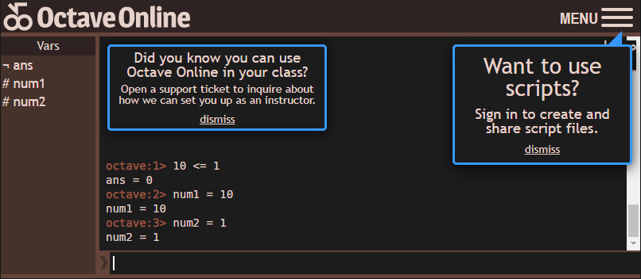](#nolink)

### **Logical Operators**

* Piggybacking off the Boolean results (`true`/`false`) from relational operators, we can also compare Booleans  in logical operations

Operator | Definition
--- | ---
`&&` | "And" both must be `TRUE`
`\|\|` | "Or" at least one `TRUE`

```matlab
true && true
true && false
false && false
true || true
true || false
false || false
```

[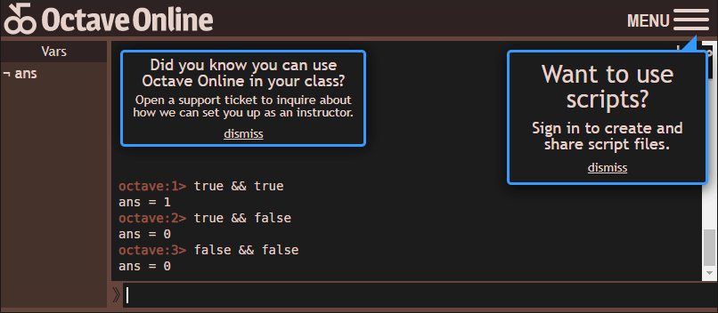](#nolink)

* We saw in the `~=` ("not equal to") relationship operator that the "`~`" means "not" a.k.a. "give me the opposite"
* Remember that the relationship operators will give Boolean results and those can be used with these logical operators

Operator | Definition
--- | ---
`~` | "Not" gives the opposite
`~true` | `false`
`~false` | `true`

```matlab
num1 = 1
num2 = 1
num1 ~= num2
~(num1 ~= num2)
```

[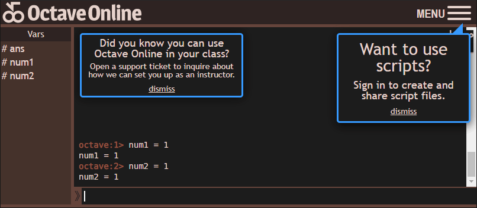](#nolink)

[Back to Top](#table-of-contents)

--------------------------------------------------------------------------------------------------

<a name="5-data-structures"></a>

## 5. Data Structures

**Earlier, we've seen simple number and string data types being stored in variables; now let's look at more complex data structures**

### **Array**

* A variable can also represent a larger body of data
* You can group many individual pieces of data into an **array** using square brackets `[]` and even reference individual indices by number using parenthesis `()`:
   * Note: Index numbers start from 1 in MATLAB

```matlab
arr = [7 8 9]
disp(arr)
disp(arr(1))
disp(arr(3))
```
[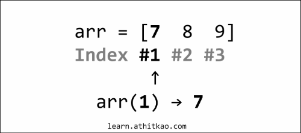](#nolink)

[](#nolink)

### **Building an Array**

* We can easily add new data into an array by including the previous array in the new array
* Let's add some numbers in front of and at the end of an existing array:

```matlab
arr = [2 3]
disp(arr)
arr = [1 arr]
disp(arr)
arr = [arr 4]
disp(arr)
```

[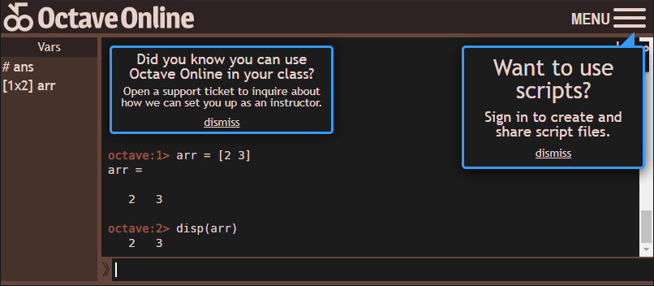](#nolink)

---

### **Structures**

* An array of numbers doesn't sound too exciting, how about Twitter tweets?
* Since there's a bit more complicated data with tweets, we can use structures or `struct`s to give each index a name:

```matlab
tweet1 = struct(
   'user', 'atet',
   'time', '8:15 AM',
   'text', 'Hello!')
disp(tweet1)
disp(tweet1.user)
```

[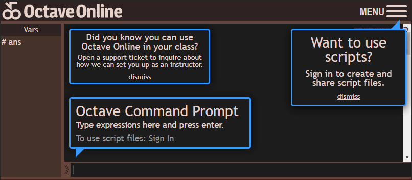](#nolink)

### **Array of Structures**

* What if we need to store a collection of these complex structures?
* Fortunately, **Arrays** can store other arrays or even `struct`s
* Below, we will build an array of two `struct`s and reference array indices by numbers and the `struct` indices by name:

```matlab
tweet1 = struct(
   'user', 'atet',
   'time', '8:15 AM',
   'text', 'Hello!')
tweet2 = struct(
   'user', 'atet',
   'time', '8:16 AM',
   'text', 'World!!')
tweets = [tweet1 tweet2]
disp(tweets(1))
disp(tweets(2))
disp(tweets(1).text)
disp(tweets(2).text)
```

[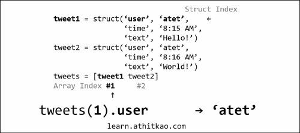](#nolink)

[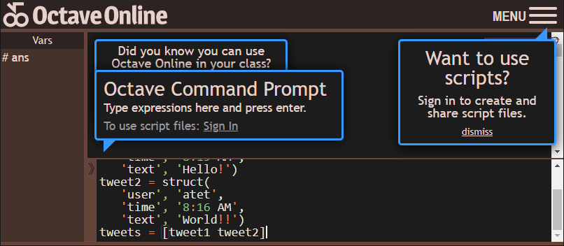](#nolink)

### **Data Range**

* MATLAB has some handy shortcuts to help when dealing with ranges of numbers
* If we had to make an ordered array of numbers from 1 to 10 (_or a billion!_), we could use the special colon ("`:`") operator to help:

```matlab
disp([1 2 3 4 5 6 7 8 9 10])
disp([1:10])
```

[](#nolink)

[Back to Top](#table-of-contents)

--------------------------------------------------------------------------------------------------

<a name="6-control-structures"></a>

## 6. Control Structures

**Earlier, we've used Booleans for comparisons; now let's use them to control what code will run**

### **Conditional Statements**

* Booleans can also control what code will run in conditional statements
* The example below shows an "`if`" conditional statement that executes only when the result after the `if` is `true`:
   * Note: You must end the `if` statement with an `end`
   * Note: Since MATLAB uses single quotes "`'`" to surround strings, you must escape single quotes with another single quote if they are used in the string

```matlab
tweet_count = 5

if tweet_count > 10
   disp('That''s a lot of tweets!')
end

tweet_count = tweet_count + 100

if tweet_count > 50
   disp('Too many tweets!')
end
```

* If we run the above code, we will see that only the second `if` statement executes ("`Too many tweets!`") since its condition was satisfied (`tweet_count` of 105 is greater than 50)
* We can use an "`else`" statement in conjunction, which execute only when the `if` condition is **not** satisfied

```matlab
tweet_count = 7

if tweet_count > 10
   disp('That''s a lot of tweets!')
else
   disp('Get more tweets!')
end
```

* These examples seem to be pretty benign, but maybe you'll have to use these control structures for something important one day:

```matlab
ants = 1000

if ants > 900
   disp('Start exterminator program...')
end
```

[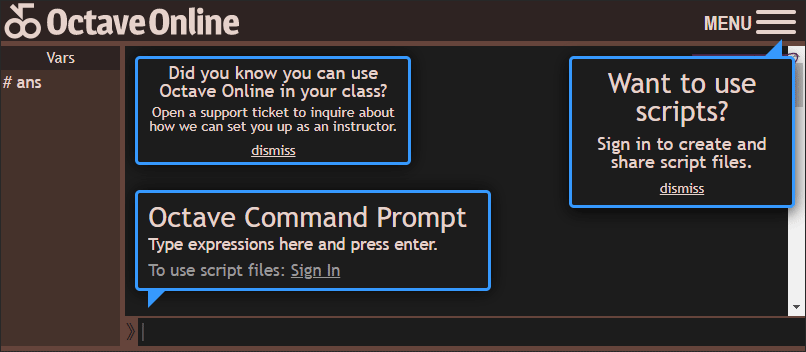](#nolink)

### **Loops**

**Our final topic will combine data structures with conditional statements to produce a powerful programming tool**

* Essentially loops will help you plow through a lot of data quickly by literally "looping" through code
* It may help to think of loops conceptually rather than the actual code you see
* There are three essential parts to a loop:
1. Initialization - Code that sets the starting parameters of a loop
2. Condition - A condition that must be satisfied to continue the loop
3. Body - Code that will execute if the condition remains TRUE

[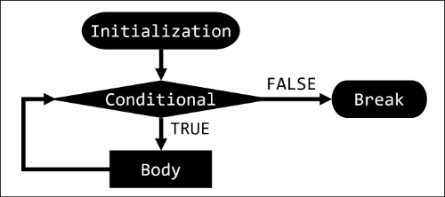](#nolink)

* If we run the loop below, we see that the variable `this_index` continues to increment every loop iteration until it is no longer less than `last_index` and "`break`s" out of the loop
* As the loop iterates, `this_index` increments and is used to print out different cells from the cell array `words`:
   * Note: For more information about using cell arrays for strings [click here](https://octave.org/doc/v4.2.2/Cell-Arrays-of-Strings.html)

```matlab
words = ['Hello'; 'World'; '!']
this_index = 1
last_index = 3
while this_index <= last_index
   disp(words(this_index,:))
   this_index = this_index + 1
end
disp('Loop Done!')
```

#### Loops with repetitive tasks

* Computers work blazingly fast to our benefit; running the above loop finishes instantaneously
* Let's see if we can push the limits by figuring out if `997` is a prime number (divisible only by 1 and itself)
* We can do this by looping through integers `2` through `499` (about half of `997`) and seeing if any of them divide cleanly without any remainder
   * Note: We will use the modulus mathematical function "`mod()`" that will calculate any remainder from a division, e.g. `mod(4, 2) = 0` while `mod(5, 2) = 1`

```r
dividend = 997
divisor = 2
while true
   if divisor > (dividend / 2)
      disp('I am a prime!!!')
      break
   end
   if mod(dividend, divisor) == 0
      disp('I am not a prime.')
      break
   end
   divisor = divisor + 1
end
```

[](#nolink)

**Holy cow that was quick!** I don't know about you, but I wouldn't have wanted to perform ~500 divisions even _with_ a calculator

[Back to Top](#table-of-contents)

--------------------------------------------------------------------------------------------------

<a name="7-epilogue"></a>

## 7. Epilogue

* We have reviewed the critical building blocks needed for a strong foundation of computer science theory
* These themes will echo in every programming language and are components to even the most complex programs
* Always remember: If you ever reach a roadblock, your answer is just a well-crafted Google search away:

[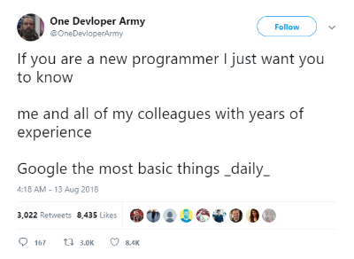](#nolink)

[Back to Top](#table-of-contents)

--------------------------------------------------------------------------------------------------

<a name="8-next-steps"></a>

## 8. Next Steps

* I recommend going over this material one more time to solidify these concepts
* You can continue to use the same web-based programming environment as you continue into advanced concepts; **no need to distract yourself with installing things** right now
* There is so much free educational materials out on the internet, find the best content that fits your learning style
* Though the free, open source [Octave language](https://www.gnu.org/software/octave/index) is extremely similar to the commercial, proprietary [MATLAB language](https://www.mathworks.com/pricing-licensing.html), there are notable differences explained here: [https://en.wikibooks.org/wiki/MATLAB_Programming/Differences_between_Octave_and_MATLAB](https://en.wikibooks.org/wiki/MATLAB_Programming/Differences_between_Octave_and_MATLAB)

[Back to Top](#table-of-contents)

--------------------------------------------------------------------------------------------------

<a name="other-languages"></a>

## Other Languages

* Regardless of the difference in [syntax](https://www.google.com/search?q=syntax&oq=syntax) between languages, they will all share a common theory of how things work
* All languages will have variables, operators, data types, data structures, and control structures
* Here's an example of the similarities and differences in three popular programming languages:

### **MATLAB**

> The words "`Hello World!`" are assigned to the variable `greeting` and then "displayed"
>
> ```
> >> greeting = 'Hello World!'
> >> disp(greeting)
> Hello World!
> ```

### **Python**

> The exact same thing as above was performed, but Python has different syntax for printing to console
>
> ```
> >>> greeting = "Hello World!"
> >>> print(greeting)
> Hello World!
> ```

### **JavaScript**

> The exact same thing as above was performed, but JavaScript has different syntax for printing to console
>
> ```
> > greeting = "Hello World!"
> > console.log(greeting)
> Hello World!
> ```

[Back to Top](#table-of-contents)

--------------------------------------------------------------------------------------------------

<a name="acknowledgments"></a>

## Acknowledgments

1. Web-based GNU Octave console by Octave Online: <a href="https://github.com/octave-online/octave-online-server" target="_blank">https://github.com/octave-online/octave-online-server</a>

<a href="" target="_blank"></a>

[Back to Top](#table-of-contents)

--------------------------------------------------------------------------------------------------

<p align="center">Copyright © 2020-∞ Athit Kao, <a href="http://www.athitkao.com/tos.html" target="_blank">Terms and Conditions</a></p>